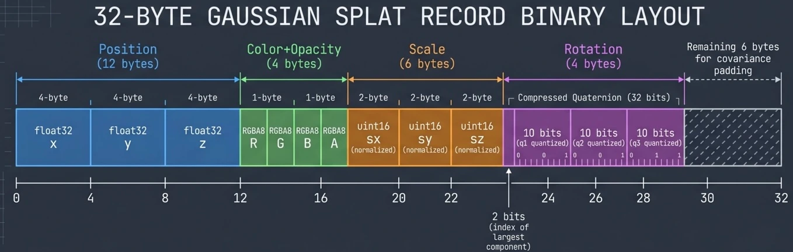

# Topic 1: The LCC Format and the XGRIDS LiDAR Pipeline

## 32 Bytes Per Splat

The LCC (Lixel CyberColor) format from XGRIDS packs everything you need to render a single Gaussian splat into exactly 32 bytes. That's remarkably compact -- a million splats is just 32 MB of binary data.

Here's how those bytes break down:

| Offset | Size | Field | Encoding |
|--------|------|-------|----------|
| 0 | 12 B | Position (x, y, z) | `float32` x 3 |
| 12 | 4 B | Color + Opacity | `uint8` RGBA (R, G, B packed in lower 24 bits, opacity in top 8) |
| 16 | 6 B | Scale (sx, sy, sz) | `uint16` x 3, normalized 0-65535 then lerped into a min/max range |
| 22 | 4 B | Rotation | Compressed quaternion: 10+10+10 bits for three components, 2 bits for the index of the largest (omitted) component |
| 26 | 6 B | (padding / alignment) | |

<!-- NBP_DIAGRAM
Technical infographic showing the binary layout of a single 32-byte Gaussian splat record. A horizontal strip divided into labeled colored segments: Position (12 bytes, float32 x3, blue), Color+Opacity (4 bytes, RGBA8, green), Scale (6 bytes, uint16 x3 normalized, orange), Rotation (4 bytes, compressed quaternion 10+10+10+2 bits, purple), with remaining 6 bytes for covariance padding. Byte offsets labeled below. Clean engineering diagram style, dark background, monospace labels.
-->


The loader (`lcc-loader.mjs`) reads this with a `DataView` in a tight loop:

```javascript
// lcc-loader.mjs, parseSplats() -- 32 bytes per splat
const o = i * BYTES_PER_SPLAT;  // BYTES_PER_SPLAT = 32

positions[i * 3]     = view.getFloat32(o, true);      // x
positions[i * 3 + 1] = view.getFloat32(o + 4, true);  // y
positions[i * 3 + 2] = view.getFloat32(o + 8, true);  // z

const colorEnc = view.getUint32(o + 12, true);
colors[i * 3]     = (colorEnc & 0xFF) / 255;          // R
colors[i * 3 + 1] = ((colorEnc >> 8) & 0xFF) / 255;   // G
colors[i * 3 + 2] = ((colorEnc >> 16) & 0xFF) / 255;  // B
opacities[i]      = ((colorEnc >> 24) & 0xFF) / 255;   // A
```

## The Compressed Quaternion

The rotation quaternion uses a clever compression trick. A unit quaternion has four components that satisfy `w^2 + x^2 + y^2 + z^2 = 1`, so you only need to store three -- the fourth can be recovered with a square root. The 2-bit index tells you which component was the largest (and therefore omitted), and the remaining three are each stored in 10 bits, mapped from the range `[-1/sqrt(2), 1/sqrt(2)]`.

```javascript
// lcc-loader.mjs, decodeRotation()
const pq0 = (enc & 1023) / 1023;            // 10 bits
const pq1 = ((enc >> 10) & 1023) / 1023;    // 10 bits
const pq2 = ((enc >> 20) & 1023) / 1023;    // 10 bits
const idx = (enc >> 30) & 3;                 // 2 bits: which component was largest

const q0 = pq0 * SQRT2 - RSQRT2;  // map [0,1] -> [-1/sqrt(2), 1/sqrt(2)]
const q1 = pq1 * SQRT2 - RSQRT2;
const q2 = pq2 * SQRT2 - RSQRT2;
const q3 = Math.sqrt(Math.max(0, 1 - q0*q0 - q1*q1 - q2*q2));  // recover 4th
```

A `QLUT` lookup table then reorders the components back into their original positions based on `idx`.

## Progressive LOD Loading

The LCC format supports multiple levels of detail. The `meta.lcc` JSON file lists splat counts per LOD level, and the loader uses HTTP `Range` headers to fetch only the bytes for the target LOD:

```javascript
// lcc-loader.mjs, load()
const dataResponse = await fetch(dataUrl, {
    headers: { 'Range': `bytes=${dataOffset}-${dataOffset + dataSize - 1}` }
});
```

This means a viewer can start with a coarse preview and progressively refine -- the CDN serves the same `data.bin` file, the client just requests different byte ranges.

## XGRIDS vs. COLMAP: A Fundamentally Different Pipeline

Most 3D Gaussian Splat datasets you'll find online were created with COLMAP -- the open-source photogrammetry pipeline. COLMAP takes hundreds of photographs, runs Structure-from-Motion to estimate camera poses, then Multi-View Stereo to build a dense point cloud, and finally optimizes that into Gaussian splats. It's powerful, but the compute cost is substantial: hours of GPU time for a single room.

XGRIDS takes a different approach entirely. Their capture device uses a LiDAR scanner to measure depth directly at scan time. The LiDAR hardware does the expensive 3D localization that COLMAP does in software -- and it does it in real time, on a handheld device.

The trade-off is clear: you need a LiDAR-equipped device (iPhone Pro, iPad Pro, or dedicated scanner), but you skip the most expensive step in the pipeline. There's no Structure-from-Motion pass, no Multi-View Stereo reconstruction, no hours-long optimization. The splats come out positioned in 3D space because the sensor measured that directly.

<!-- NBP_DIAGRAM
Side-by-side comparison infographic of two 3D Gaussian Splat creation pipelines. LEFT: "Traditional COLMAP Pipeline" -- icons flowing top-to-bottom: Camera icon -> "Capture 100s of photos" -> "Structure from Motion (SfM)" -> "Multi-View Stereo (MVS)" -> "Dense Point Cloud" -> "Splat Optimization (hours)" -> Splat output. RIGHT: "XGRIDS LiDAR Pipeline" -- icons flowing top-to-bottom: Phone with LiDAR sensor -> "Scan with LiDAR + Camera" -> "On-device depth from LiDAR" -> "Direct splat placement" -> Splat output. The right pipeline is visibly shorter with fewer steps. Arrows and clean line art, minimal color palette, dark background.
-->


## The Camera-Up Convention

Here's a subtle compatibility win: the LCC format uses the same Y-up coordinate system as LMV. That matters more than you might think.

Spherical harmonics coefficients -- used for view-dependent color in "Quality" mode -- are defined relative to the coordinate frame of the capture. If the capture device and the viewer disagree on which way is up, you'd need to rotate the SH basis to compensate. That's not hard math, but it's an easy place for a sign error to hide.

Because XGRIDS and LMV agree on camera-up, the splat positions and SH coefficients load directly with no basis rotation. The only transforms needed are a meters-to-feet scale factor (LMV's Revit models are in feet) and a scene-alignment rotation:

```javascript
// app.mjs
const METERS_TO_FEET = 3.28084;
splatRenderer.mesh.scale.set(METERS_TO_FEET, METERS_TO_FEET, METERS_TO_FEET);
splatRenderer.mesh.rotation.z = -Math.PI / 4;
```

---

**Next:** [Why Splats Need Sorting (and Why That Needs a Web Worker)](topic2.md)
