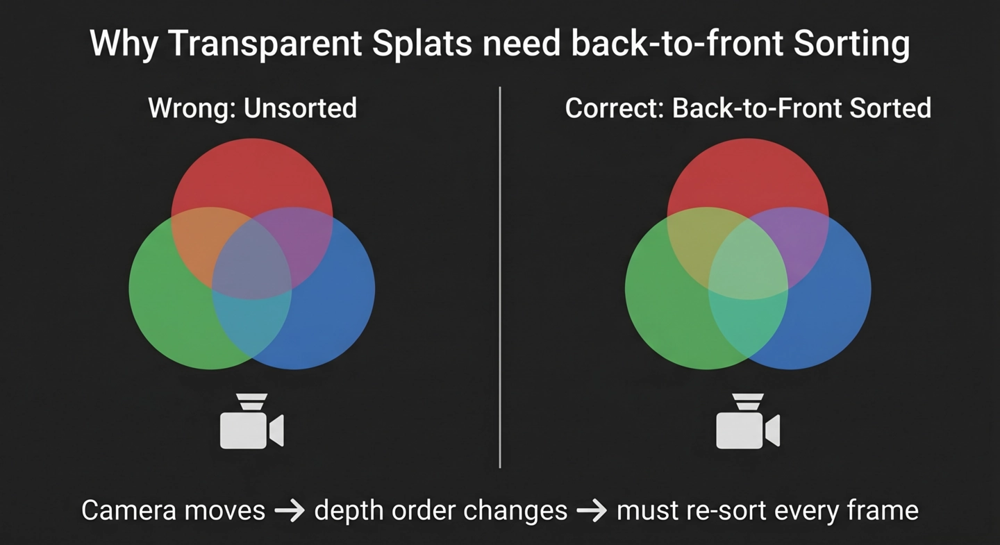

# Topic 2: Why Splats Need Sorting (and Why That Needs a Web Worker)

## The Transparency Problem

If you've worked with opaque geometry in WebGL, you're used to the Z-buffer doing the heavy lifting. Draw your triangles in any order, and the depth test ensures that only the closest fragment survives. Simple.

Gaussian splats break that assumption completely. Every splat is semi-transparent -- it's a soft, fuzzy blob that you see *through*. And transparent primitives can't rely on the Z-buffer. If you draw a nearby transparent splat first and then a faraway one behind it, the blending equation produces the wrong color. The math only works if you draw back-to-front: farthest splat first, nearest splat last.

This is the painter's algorithm, and it means that every time the camera moves, the entire set of splats needs to be re-sorted by depth.

<!-- NBP_DIAGRAM
Split-panel infographic showing why transparent splats need back-to-front sorting. LEFT panel labeled "Wrong: Unsorted" shows three overlapping translucent colored circles (red, green, blue) composited in random order, resulting in muddy incorrect colors where they overlap. RIGHT panel labeled "Correct: Back-to-Front Sorted" shows the same three circles composited in proper depth order, with clean natural color blending at overlaps. A camera icon at the bottom of each panel shows the viewpoint. Below, a simple arrow diagram: "Camera moves -> depth order changes -> must re-sort every frame." Clean infographic style, dark background.
-->


## A Million Splats Need a Fast Sort

For a scene with 1-2 million splats, a naive comparison sort (quicksort, mergesort) would take O(n log n) comparisons -- on the order of 20 million operations per sort. At 60fps that's a non-starter.

The renderer uses a **counting sort** instead. The idea is simple: quantize each splat's depth into an integer bucket, count how many splats land in each bucket, then use the counts to place each splat directly into its sorted position. No comparisons needed.

Here's the core of it from the Web Worker:

```javascript
// splat-renderer.mjs, worker sort routine

// 1. Compute integer depth for each splat
for (let i = 0; i < splatCount; i++) {
    const depth = ((vm[2]*x + vm[6]*y + vm[10]*z) * 4096) | 0;
    sizeList[i] = depth;
}

// 2. Quantize into 65536 buckets
const depthInv = 65536 / (maxDepth - minDepth + 1);
const counts = new Uint32Array(65536);
for (let i = 0; i < splatCount; i++) {
    sizeList[i] = ((sizeList[i] - minDepth) * depthInv) | 0;
    counts[sizeList[i]]++;
}

// 3. Prefix sum gives starting index for each bucket
const starts = new Uint32Array(65536);
for (let i = 1; i < 65536; i++) starts[i] = starts[i-1] + counts[i-1];

// 4. Place each splat into its sorted position
for (let i = 0; i < splatCount; i++) depthIndex[starts[sizeList[i]]++] = i;
```

This is O(n + k) where k = 65536 buckets. For a million splats, that's roughly 1 million operations plus a fixed 65K prefix sum -- dramatically faster than any comparison sort.

The depth computation itself is a dot product with the third row of the view matrix, which gives the Z-distance from the camera. Multiplying by 4096 and truncating to integer gives enough precision for correct ordering without floating-point sort overhead.

<!-- NBP_DIAGRAM
Two-part technical infographic. TOP HALF labeled "Counting Sort in 4 Steps": a horizontal pipeline showing the sort algorithm visually. Step 1 "Compute Depth": a row of colored splat dots with arrows pointing down to integer depth values (e.g. 12, 847, 3, 512...). Step 2 "Count Buckets": a histogram bar chart with 65536 bins along the x-axis (only a few representative bins shown), each bar showing how many splats fell in that depth bucket. Step 3 "Prefix Sum": the same histogram but with cumulative counts, arrows showing each bin's start index. Step 4 "Place": splats rearranged into a single sorted row, back-to-front, colored dots now in smooth depth gradient order. Label: "O(n + k), no comparisons." BOTTOM HALF labeled "Web Worker Architecture": a swim-lane diagram with two lanes -- "Main Thread" and "Worker Thread". Main Thread lane shows: "Camera moves" -> "Send view matrix (postMessage)" -> dotted waiting line -> "Receive sorted buffers" -> "Upload to GPU". Worker Thread lane shows: "Receive view matrix" -> "Counting sort (10-20ms)" -> "Shuffle all 6 attribute arrays" -> "Post sorted buffers back". A clock icon on the main thread lane shows "0ms blocked -- rendering continues". Clean schematic style, dark background, minimal color palette.
-->


## Why a Web Worker

Even with a fast sort, shuffling six attribute arrays (positions, colors, opacities, covA, covB) for a million splats takes real time -- roughly 10-20ms of pure CPU work. On the main thread, that's a visible frame stutter.

The solution is a dedicated Web Worker. The sort runs entirely off the main thread:

1. **Main thread** detects the camera has moved (matrix diff > 0.1) and sends the view matrix to the worker
2. **Worker** performs the counting sort and shuffles all attribute arrays into sorted order
3. **Worker** posts the sorted arrays back
4. **Main thread** copies the sorted data into the GPU buffer attributes and flags them for upload

```javascript
// splat-renderer.mjs, update() -- throttled sort dispatch
const now = performance.now();
if (!this.isWorkerSorting && (now - this.lastSortTime) > this.sortInterval) {
    let diff = 0;
    const els = camera.matrixWorld.elements;
    const last = this.lastCameraMatrix.elements;
    for (let i = 0; i < 16; i++) diff += Math.abs(els[i] - last[i]);
    if (diff > 0.1) {
        this.isWorkerSorting = true;
        this.worker.postMessage({
            type: 'sort',
            data: { viewMatrix: Array.from(camera.matrixWorldInverse.elements) }
        });
    }
}
```

The sort is also throttled to fire at most every 700ms. During a smooth orbit, the depth order doesn't change drastically between frames, so running the sort at ~1.4 Hz is enough to avoid visible artifacts while keeping CPU usage low.

## The Trade-off

There's an inherent latency: when the camera moves, the splats render for a few frames in slightly stale order before the worker finishes sorting and the buffers update. In practice this manifests as subtle flickering at splat edges during fast camera motion. It's the same trade-off every real-time 3DGS renderer makes -- correctness versus frame rate.

Some implementations use `SharedArrayBuffer` and `Atomics` to avoid the copy overhead of `postMessage`. Others use GPU-based radix sort in a compute shader. This implementation keeps things simple: plain `postMessage` with copied buffers, which works in all browsers without special headers.

---

**Next:** [From Point Clouds to Gaussian Splats: The Shader](topic3.md)
