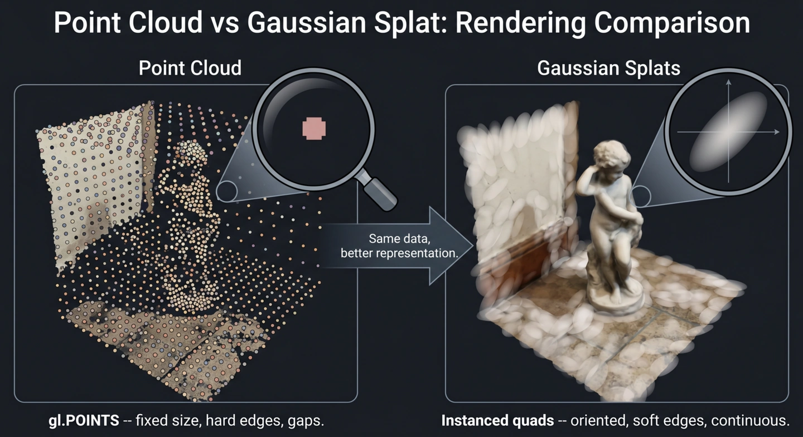
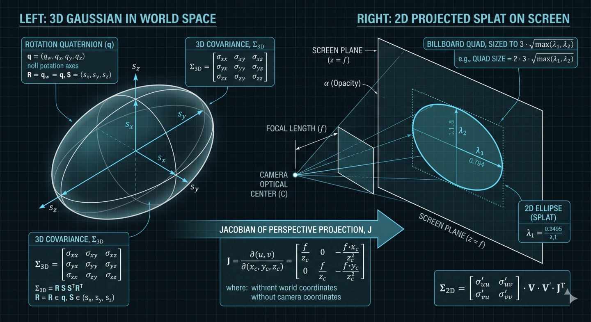

# Topic 3: From Point Clouds to Gaussian Splats: The Shader

## If You Can Render Points, You're Halfway There

Point cloud rendering is straightforward: upload an array of (x, y, z) positions and (r, g, b) colors, set `gl.drawArrays(gl.POINTS, ...)`, and the GPU draws a fixed-size dot at each position. You get a cloud of colored pixels. It works, but it looks sparse -- gaps between points, no sense of surface.

Gaussian splatting replaces each fixed-size point with an oriented, soft-edged ellipse. The ellipse's size and shape come from a 3D covariance matrix that describes how "spread out" the Gaussian is in each direction. Project that 3D ellipsoid through the camera, and you get a 2D ellipse on screen -- one that blends smoothly into its neighbors.

The conceptual jump is smaller than it sounds: instead of a dot, you're drawing a textured quad whose "texture" is a mathematically computed Gaussian falloff.

<!-- NBP_DIAGRAM
Side-by-side comparison infographic: "Point Cloud vs Gaussian Splat". LEFT panel labeled "Point Cloud": a cluster of small, fixed-size, hard-edged colored dots with visible gaps between them, rendered on a surface like a wall or floor. Each dot is the same size regardless of distance. A zoomed-in inset shows the hard pixel boundary of a single dot. Caption: "gl.POINTS -- fixed size, hard edges, gaps." RIGHT panel labeled "Gaussian Splats": the same scene but each point is replaced by a soft, oriented, semi-transparent ellipse with smooth Gaussian falloff edges. The ellipses overlap and blend together to form a continuous, photorealistic surface with no gaps. A zoomed-in inset shows a single ellipse with a smooth radial gradient from opaque center to transparent edge, with faint axes indicating orientation. Caption: "Instanced quads -- oriented, soft edges, continuous." An arrow between the two panels labeled "Same data, better representation." Clean technical illustration style, dark background.
-->


## The Covariance Pipeline

Each splat's shape is defined by a scale vector (how big the Gaussian is along each axis) and a rotation quaternion (how it's oriented in space). These get combined into a 3x3 covariance matrix on the CPU:

```javascript
// lcc-loader.mjs, computeCov3D()
// Rotation matrix from quaternion
const R = [
    1 - 2*(y*y + z*z), 2*(x*y - w*z), 2*(x*z + w*y),
    2*(x*y + w*z), 1 - 2*(x*x + z*z), 2*(y*z - w*x),
    2*(x*z - w*y), 2*(y*z + w*x), 1 - 2*(x*x + y*y)
];

// M = S * R, then Sigma = M^T * M
// Only the upper triangle is stored (6 floats, symmetric matrix)
```

The CPU computes `Sigma_3D` once per splat at load time. Then the vertex shader projects it to 2D every frame:

```glsl
// splat-renderer.mjs, vertex shader computeCov2D()
mat3 J = mat3(
    focal_x / t.z, 0.0, -(focal_x * t.x) / (t.z * t.z),
    0.0, focal_y / t.z, -(focal_y * t.y) / (t.z * t.z),
    0.0, 0.0, 0.0
);
mat3 V = mat3(/* upper-left 3x3 of modelViewMatrix */);
mat3 T = V * J;
mat3 cov = transpose(T) * transpose(Vrk) * T;
```

`J` is the Jacobian of the perspective projection -- it captures how small movements in view space map to pixel movements on screen. Multiplying `J * V * Sigma * V^T * J^T` transforms the 3D covariance into a 2D screen-space covariance. The result is a 2x2 symmetric matrix (three unique values: `cov.x`, `cov.y`, `cov.z`) that defines the screen-space ellipse.

<!-- NBP_DIAGRAM
Technical diagram showing the projection of a 3D Gaussian splat onto a 2D screen. LEFT: A 3D ellipsoid in world space, with three principal axes drawn, labeled with scale values (s_x, s_y, s_z) and a rotation quaternion. An arrow labeled "Jacobian of perspective projection" points to the RIGHT: a 2D ellipse on a flat screen plane, with semi-major and semi-minor axes labeled lambda_1 and lambda_2. A dotted bounding box around the ellipse labeled "billboard quad sized to 3*sqrt(max(lambda_1, lambda_2))". A camera frustum drawn between the two, showing the projection rays. Math notation shown subtly: "Sigma_2D = J * V * Sigma_3D * V^T * J^T". Clean technical illustration, blueprint style, dark background.
-->


## Sizing the Billboard Quad

Each splat is rendered as an instanced quad -- four vertices, two triangles. But how big should the quad be? Too small and the Gaussian gets clipped. Too big and you waste fragment shader invocations on pixels that contribute nothing.

The answer comes from the eigenvalues of the 2D covariance:

```glsl
float mid = 0.5 * (cov.x + cov.z);
float lambda1 = mid + sqrt(max(0.1, mid * mid - det));
float lambda2 = mid - sqrt(max(0.1, mid * mid - det));
float my_radius = ceil(3.0 * sqrt(max(lambda1, lambda2)));
```

The eigenvalues are the squared semi-axes of the ellipse. Taking `3 * sqrt(max(...))` gives a radius that captures 99.7% of the Gaussian's energy (the "three sigma" rule). The quad is then sized to `[-my_radius, +my_radius]` in screen pixels.

## The Fragment Shader: Evaluating the Gaussian

The fragment shader is short -- and that's the point. Each fragment just evaluates whether it's inside the Gaussian and how much alpha it should contribute:

```glsl
void main() {
    vec2 d = v_xy - v_pixf;
    float power = -0.5 * (v_con_o.x * d.x * d.x + v_con_o.z * d.y * d.y)
                  - v_con_o.y * d.x * d.y;
    if (power > 0.0) discard;
    float alpha = min(0.99, v_con_o.w * exp(power));
    if (alpha < 0.004) discard;
    vec3 linear = pow(v_col, vec3(2.2));
    gl_FragColor = vec4(linear * alpha, alpha);
}
```

`v_con_o.xyz` contains the conic form of the 2D covariance inverse (passed from the vertex shader), and `d` is the pixel offset from the splat center. The `exp(power)` call computes the Gaussian falloff. Fragments with negligible alpha are discarded early to save blending cost.

## Premultiplied Alpha Blending

The output color is premultiplied: `color * alpha` in RGB, raw `alpha` in A. The blend equation is set up to match:

```javascript
blending: THREE.CustomBlending,
blendSrc: THREE.OneFactor,           // result += src * 1
blendDst: THREE.OneMinusSrcAlphaFactor  // result += dst * (1 - srcAlpha)
```

This is the standard premultiplied-alpha over operator. Combined with back-to-front sorting (see [Topic 2](topic2.md)), it produces correct transparent compositing. Depth testing and depth writing are both disabled -- ordering is handled entirely by the sort.

## Instanced Rendering on LMV's R71 Three.js

Modern Three.js has `InstancedBufferGeometry` and `InstancedBufferAttribute`. LMV's bundled R71 fork doesn't. The workaround:

```javascript
// BufferGeometry with explicit instance count
this.geometry = new THREE.BufferGeometry();
this.geometry.numInstances = n;

// BufferAttribute with divisor=1 (advance once per instance, not per vertex)
function makeInstancedAttr(array, itemSize) {
    const attr = new THREE.BufferAttribute(array, itemSize);
    attr.divisor = 1;
    return attr;
}
```

The base quad (4 vertices) is shared across all instances. The per-splat attributes -- center, color, opacity, covA, covB -- advance once per instance via `divisor = 1`. The GPU draws `numInstances` copies of the quad, each positioned and shaped by its own splat data.

This is the same math from the original "3D Gaussian Splatting for Real-Time Radiance Field Rendering" paper (Kerbl et al., 2023), adapted from the `lcc-decoder` reference implementation for LMV's older Three.js runtime.

---

**Next:** [Section Planes: Making Splats Play Nice with BIM Tools](topic4.md)
