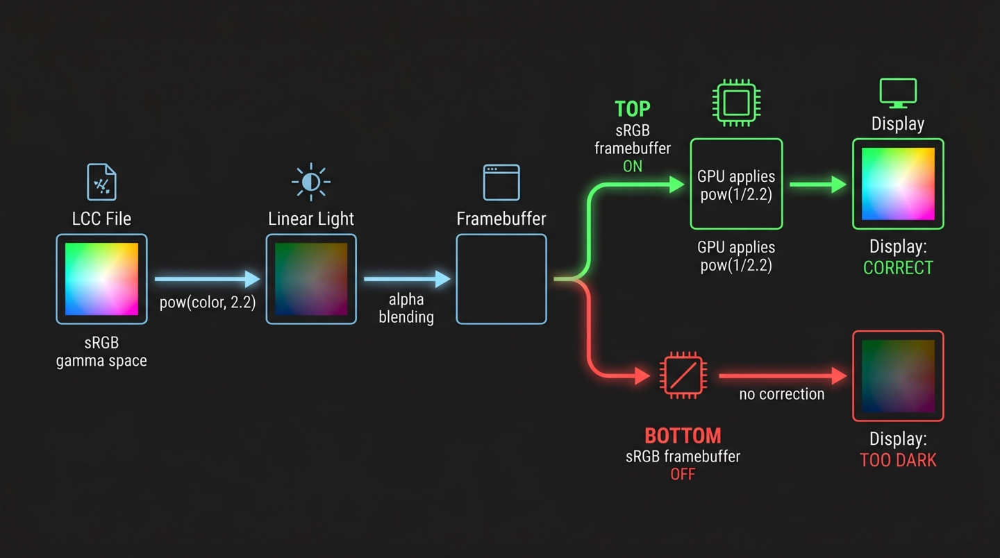

# Topic 5: The Gamma 2.2 Problem

## One Line, a Lot of Weight

There's a single line in the fragment shader that does more than it looks:

```glsl
vec3 linear = pow(v_col, vec3(2.2));
gl_FragColor = vec4(linear * alpha, alpha);
```

This converts the splat's color from sRGB gamma space to linear light before blending. It's the kind of line that's easy to copy from a reference implementation without thinking about it. But getting it wrong -- or getting it right in the wrong context -- produces colors that are either too dark, too washed out, or subtly wrong in a way that's hard to diagnose.

## Why the Conversion Exists

The LCC format stores per-splat colors as 8-bit sRGB values (0-255 for each of R, G, B, normalized to 0.0-1.0 by the loader). sRGB is a non-linear encoding designed to match human perception: it allocates more bits to dark tones, where your eyes are more sensitive, and fewer bits to bright tones. This is what your monitor expects.

But GPU blending math is linear. When the blend equation computes `src * 1 + dst * (1 - srcAlpha)`, it assumes the color values represent physical light intensity. If you feed it sRGB-encoded values, the blending "averages" happen in the wrong space. Dark regions get crushed, and overlapping semi-transparent splats produce muddy midtones.

The `pow(color, 2.2)` approximation converts from sRGB's perceptual encoding to linear light, where the blending math is physically correct.

## The Pipeline Fork

Here's where it gets tricky. After blending, the result is written to a framebuffer. What happens next depends on the framebuffer's configuration:

**Path A -- sRGB framebuffer enabled:** The GPU automatically applies the inverse gamma curve (`pow(color, 1/2.2)`) when writing to the framebuffer. The linear blending result gets re-encoded to sRGB, which is what the monitor expects. Colors look correct.

**Path B -- sRGB framebuffer disabled:** The linear blending result is written directly to the framebuffer with no conversion. The monitor interprets these linear values as sRGB, and everything looks too dark because the linearization was never reversed.

<!-- NBP_DIAGRAM
Horizontal pipeline infographic showing color data flowing left to right through the rendering pipeline. Stage 1: "LCC File" box containing a color swatch in sRGB gamma space (bright). Stage 2: arrow labeled "pow(color, 2.2)" leading to "Linear Light" box (darker version of same color). Stage 3: arrow labeled "alpha blending" leading to "Framebuffer" box. Then a fork: TOP path labeled "sRGB framebuffer ON" -> arrow "GPU applies pow(1/2.2)" -> "Display: CORRECT" (color matches original). BOTTOM path labeled "sRGB framebuffer OFF" -> arrow "no correction" -> "Display: TOO DARK" (crushed dark color). The correct path highlighted green, the broken path highlighted red. Clean schematic style, dark background.
-->


## The LMV Complication

The splat renderer doesn't create its own framebuffer -- it renders into LMV's overlay scene, which is composited by LMV's render pipeline. Whether that pipeline uses an sRGB-encoded framebuffer depends on LMV's internal `RenderContext` configuration, which can vary between viewer versions and rendering modes.

The current code has no explicit sRGB framebuffer management. It relies on LMV's pipeline to do the right thing. If LMV's `RenderContext` has `gl.getExtension('EXT_sRGB')` active and writes to an sRGB renderbuffer, Path A kicks in and colors are correct. If not, you're on Path B and the splats appear too dark.

This is a known pain point. The "right" fix would be one of:

1. **Query LMV's framebuffer state** and conditionally skip the linearization if the framebuffer isn't sRGB
2. **Apply the inverse gamma in the fragment shader** (`pow(blended, vec3(1.0/2.2))`) before output, which assumes a linear framebuffer
3. **Use the sRGB texture extension** to let the GPU handle the conversion automatically via `SRGB8_ALPHA8` texture formats

None of these are implemented. The current approach works correctly *most of the time* because LMV's default rendering path does use sRGB framebuffers, but it's fragile.

## Lineage

This pattern -- the `pow(v_col, vec3(2.2))` in the fragment shader with no explicit framebuffer management -- traces back through the `lcc-decoder` reference implementation to the broader WebGL 3DGS community. Early implementations like [antimatter15/splat](https://github.com/antimatter15/splat) established many of the shader conventions that subsequent renderers adopted. The gamma handling has been a recurring discussion point across these projects, with different renderers making different assumptions about the output framebuffer.

The 2.2 exponent itself is an approximation -- the actual sRGB transfer function uses a piecewise curve with a linear segment near zero. For 8-bit color values the difference is negligible, but it's one more thing to be aware of if you're chasing exact color reproduction.

---

**Next:** [Summary](summary.md)
