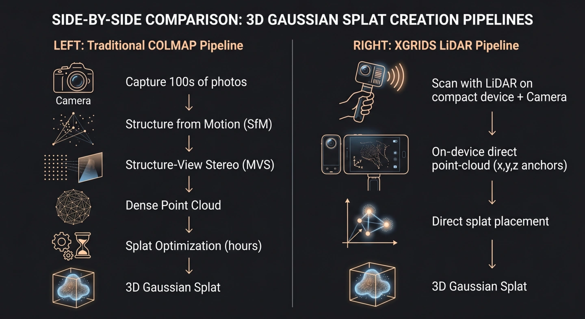
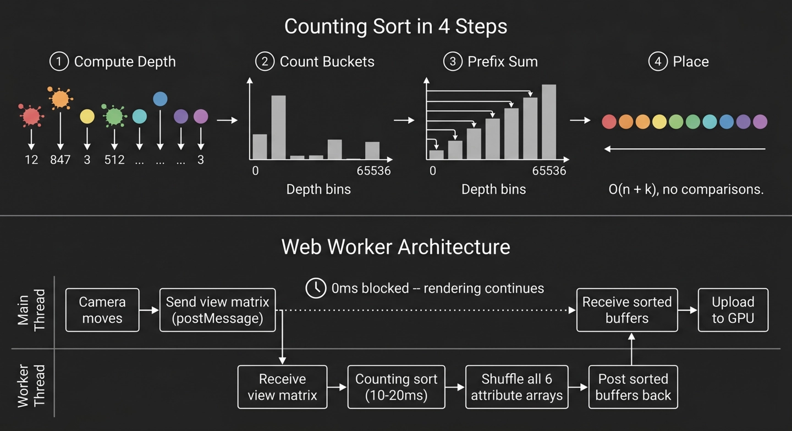

# Gaussian Splats Meet BIM: Rendering 3DGS Inside the Autodesk Viewer

What if you could overlay a photorealistic reality capture directly onto your BIM model -- right in the browser, with no plugins, no server-side rendering, and no separate viewport?


This demo decodes 3D Gaussian Splats from the XGRIDS LCC format and composites them on top of a Revit model inside the Autodesk Platform Services (APS) Viewer. The Revit geometry provides the architectural skeleton. The Gaussian splats add the captured-reality detail. The entire thing is roughly 600 lines of JavaScript.

---

## Quick Start

No build tools required. Serve the files with any static HTTP server:

```bash
# Python
python3 -m http.server 8000

# Node (npx)
npx serve .
```

Then open `http://localhost:8000` in a modern browser with WebGL support.

To load a custom LCC model, pass it as a query parameter:

```
http://localhost:8000/?lcc=https://d2pqszqfxcodwz.cloudfront.net/lcc-model/showroom+level+2/showroom2.lcc
```

---

## What's Inside

The implementation lives in three files:

| File | Lines | Role |
|------|-------|------|
| `lcc-loader.mjs` | ~210 | Decodes the XGRIDS LCC binary format: positions, colors, compressed quaternion rotations, quantized scales, and optional spherical harmonics coefficients |
| `splat-renderer.mjs` | ~375 | Instanced quad geometry, vertex/fragment shaders for Gaussian evaluation, Web Worker depth sort, cut-plane uniforms |
| `app.mjs` | ~115 | Viewer init, Revit model loading, splat overlay wiring, event bridging |

---

## The Blog Series

Those 600 lines touch a surprising number of hard problems. This five-part series walks through them.

### 1. [The LCC Format and the XGRIDS LiDAR Pipeline](blog/topic1.md)

How a single Gaussian splat gets packed into 32 bytes of binary data -- and why a LiDAR scanner on your phone can skip the most expensive step in the traditional 3DGS pipeline. XGRIDS uses hardware depth sensing instead of COLMAP's hours-long photogrammetry reconstruction, making splat capture viable on a handheld device.



### 2. [Why Splats Need Sorting (and Why That Needs a Web Worker)](blog/topic2.md)

Transparent primitives can't hide behind a Z-buffer. Every camera movement means re-sorting millions of splats back-to-front. A 65536-bucket counting sort runs in O(n) time inside a dedicated Web Worker, keeping the main thread free for rendering.



### 3. [From Point Clouds to Gaussian Splats: The Shader](blog/topic3.md)

If you've ever rendered a point cloud, you're halfway there. The leap from fixed-size dots to oriented Gaussian ellipses is smaller than it looks -- each splat is just an instanced quad whose "texture" is a mathematically computed Gaussian falloff, shaped by projecting a 3D covariance matrix through the camera.


### 4. [Section Planes: Making Splats Play Nice with BIM Tools](blog/topic4.md)

The BIM viewer's section tool cuts through both the Revit model and the splat overlay at exactly the same plane. The vertex shader evaluates the same half-space equation that LMV uses internally, so the cut aligns perfectly with no coordinate transforms or sign flips.

### 5. [The Gamma 2.2 Problem](blog/topic5.md)

A single line in the fragment shader -- `pow(v_col, vec3(2.2))` -- converts sRGB colors to linear light before blending. It's the right idea, but the correctness depends on whether the downstream framebuffer applies the inverse curve. When you're a guest in someone else's render pipeline, you don't always get to control that.

---

## Add 3DGS to Your Own APS Viewer

Already have an APS Viewer app? You can drop Gaussian splats into it with four steps.

**1. Import the loader and renderer**

```javascript
import { LCCLoader } from './lcc-loader.mjs';
import { GaussianSplatRenderer } from './splat-renderer.mjs';
```

**2. Load the LCC file and initialize the renderer**

```javascript
const loader = new LCCLoader({ targetLOD: 4 });
const data = await loader.load('https://your-cdn.com/path/to/model.lcc');

const splatRenderer = new GaussianSplatRenderer();
await splatRenderer.init(data);

// Scale and rotate to align with your model
const METERS_TO_FEET = 3.28084;
splatRenderer.mesh.scale.set(METERS_TO_FEET, METERS_TO_FEET, METERS_TO_FEET);
```

**3. Add the splat mesh as an overlay**

```javascript
viewer.impl.createOverlayScene('splats');
viewer.impl.addOverlay('splats', splatRenderer.mesh);
```

**4. Drive the render loop on camera changes**

```javascript
viewer.addEventListener(Autodesk.Viewing.CAMERA_CHANGE_EVENT, () => {
    splatRenderer.update(viewer.impl.camera);
    viewer.impl.invalidate(false, false, true);
});
```

That's it. The splats will sort, render, and composite automatically. If you also want section plane support, add one more listener:

```javascript
viewer.addEventListener(Autodesk.Viewing.CUTPLANES_CHANGE_EVENT, () => {
    splatRenderer.setCutPlanes(viewer.getCutPlanes() || []);
    viewer.impl.invalidate(false, false, true);
});
```

---

## The Key Insight

LMV's overlay scene system and its globally exposed `window.THREE` make it possible to inject arbitrary GPU-rendered content alongside BIM geometry. The splat mesh is just a `THREE.Mesh` with a custom `ShaderMaterial` -- LMV processes it through its standard render pipeline, applying the same camera, the same section planes, the same compositing.

This pattern generalizes beyond splats. Any custom visualization that can be expressed as a Three.js mesh with a shader -- point clouds, volumetric data, sensor heatmaps, flow simulations -- can be overlaid on a BIM model using the same approach.

## References

- **3D Gaussian Splatting for Real-Time Radiance Field Rendering** -- Kerbl, Kopanas, Leimkuhler, Drettakis (SIGGRAPH 2023)
- **XGRIDS** -- [xgrids.com](https://xgrids.com) -- LiDAR-based Gaussian splat capture and the LCC format
- **antimatter15/splat** -- Early WebGL Gaussian splat renderer, community reference for the shader approach
- **lcc-decoder** -- Reference JavaScript decoder for the LCC format
- **Autodesk Platform Services (APS) Viewer SDK** -- [aps.autodesk.com](https://aps.autodesk.com)
